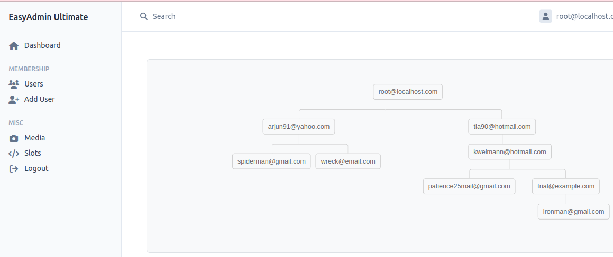

# Affiliation Service

The `AffiliationService` within EasyAdminUltimate is a robust tool for managing affiliate networks in applications. It utilizes the adjacency list model, which is an efficient way to represent hierarchical data like referral chains in a database. This service simplifies complex tasks such as tracking user referrals, retrieving the referral chain, and managing affiliate relationships. 

By injecting the `AffiliationService`, you can ensure that your application accurately reflects the dynamics of user interactions and referrals, which is crucial for any platform that relies on network growth and user engagement.

## Features

- Downline and hierarchy management
- Adjacency list model for referral structures
- Retrieval of children or ancestors
- Generation of referral links
- Verification of parent-child relationships

## Screenshot



## Example Usage

Below is an example demonstrating how to include and utilize the `AffiliationService` within a method:

```php
namespace App\Controller;

use App\Service\AffiliationService;
use Symfony\Bundle\FrameworkBundle\Controller\AbstractController;

class MyController extends AbstractController
{
    public function __construct(protected AffiliationService $affiliationService)
    {
        // Using symfony autowire mechanism
    }

    public function customMethod()
    {
        // Retrieve or define the child entity
        $childEntity = ...; 
        // Check if current user has the entity as child
        $hasChild = $this->affiliationService->hasChild($this->getUser(), $childEntity); // true|false
    }
}
```

This example shows how to inject the `AffiliationService` into a class and use the `hasChild` method to check for a parent-child relationship.

---

This concludes the overview of the `AffiliationService`. For more detailed information and advanced usage, please refer to the intenral code.

[Back To Documentation Homepage](../index.md)