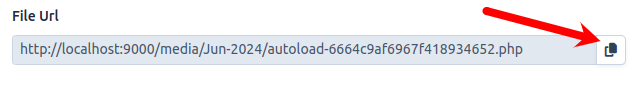

## Affix (Form Option)

The `affix` option in EasyAdminUltimate enhances form fields by allowing you to append or prepend additional content, such as buttons or icons, to the field itself.  
This feature transforms standard form elements into input groups, providing flexibility in designing user interfaces.

### Usage Example

You can use the `affix` option with form fields to append or prepend content:

```php
// App\Controller\MyCrudController;

use EasyCorp\Bundle\EasyAdminBundle\Field\TextField;

TextField::new('name')
    ->setFormTypeOption('affix', [
        'append' => [
            'type' => 'button',
            'value' => [
                'label' => 'Click Me', // Text on the button
                'attributes' => [
                    'class' => 'btn btn-secondary',
                    'data-id' => 'btn-id' // Custom data attribute
                ]
            ]
        ],
        // 'prepend' configuration can also be added similarly
    ]);
```

## Configuration Structure

The `affix` option is structured as follows:

```php
[
    'append' => [
        'type' => 'button', // Type of affix: 'text', 'icon', or 'button'
        'value' => [
            // Configuration based on the type
        ]
    ],
    'prepend' => [
        'type' => 'icon', // Example of prepend configuration
        'value' => 'fas fa-user' // Icon class
    ]
]
```

## Affix Types

#### text

Displays any string as appended or prepended content.

```php
'type' => 'text',
'value' => 'Text to append'
```

---

#### icon

Display an icon as appended or prepended content

```php
'type' => 'icon',
'value' => 'fas fa-copy'
```



The image above shows an appended "copy" icon using the affix option

---

#### button

Adds a button with customizable label (or icon) and attributes.

```php
'type' => 'button',
'value' => [
    'label' => 'Click Me',
    'attributes' => [
        'class' => 'btn btn-primary',
        'data-id' => 'button-id'
    ]
]
```

### Conclusion

The `affix` feature in EasyAdminUltimate provides powerful customization options for form fields, allowing you to create input groups with appended or prepended content such as buttons or icons. This flexibility enhances usability and user experience across your Symfony applications.

For more detailed configuration options and examples, please refer to the EasyAdminUltimate documentation and internal source code.

[Back To Documentation Homepage](../index.md)