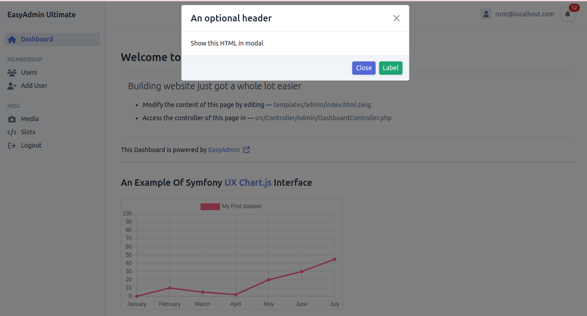

# Modal Service

The `ModalService` in EasyAdminUltimate offers the ability to present modal dialogs. While it shares similarities with the flash messages feature in Symfony, it's specifically designed for more engaging and enduring displays. This service empowers you to establish and control modals that can be displayed either once or continuously throughout various sections of your application. 

## Features

- **Display Modals:** ModalService facilitates the display of modal dialogs to convey important messages, forms, or user interactions without need to explicitly write javascript code
- **Customizable Content:** You can customize modal content, including headers, buttons, and additional features to suit specific application needs.
- **Persistent Display:** Modals can be configured to persist across page loads, providing a persistent way to communicate information or gather user input.

## Example Usage

Below is an example demonstrating how to use ModalService to display modals in your application:

```php
namespace App\Controller;

use Symfony\Bundle\FrameworkBundle\Controller\AbstractController;
use App\Model\Modal\Modal;
use App\Model\Modal\ModalButton;
use App\Service\ModalService;

class MyController extends AbstractController
{
    public function __construct(protected ModalService $modalService)
    {
        // Using symfony autowire mechanism
    }

    public function customMethod()
    {
        // optionally create custom button with custom attributes
        
        $customButton = new ModalButton('name', 'Label', [
            'class' => 'btn btn-success', 
            'data-bs-dismiss' => "modal",
            'onclick' => 'alert(`You clicked a custom modal button`)'
        ]);

        // create and configure a modal object

        $modal = (new Modal())
            ->setContent('Show this HTML in modal')
            ->setTitle('An optional header')
            ->setVisible(true) // To render the modal immediately when the page loads
            ->addButton($customButton)
            // Add more buttons or customize as needed
            // other configurations
        ;

        $this->modalService->addModal($modal);

        /**
         * No need to pass the modal service to the template
         * It is handled internally by Eau Twig Extension
         */
        return $this->render('your_template.html.twig');
    }
}
```

### Preview Result



### Integration with Twig Templates

If your template does not extends `bundles/EasyAdminBundle/layout.html.twig` by any means, you will need to include the modal utility template manually to render modals:

```twig
{# your_template.html.twig #}


    {# Render any other content #}
    

```

In this Twig template:
- `utility/modal/modals.html.twig` is included to render modals added via `ModalService`.
- The included template ensures that all modals added through `ModalService` are rendered appropriately.

---

This concludes the overview of `ModalService` in EasyAdminUltimate. For more detailed information and advanced usage, please refer to the internal source code and documentation of EasyAdminUltimate.

[Back To Documentation Homepage](../index.md)