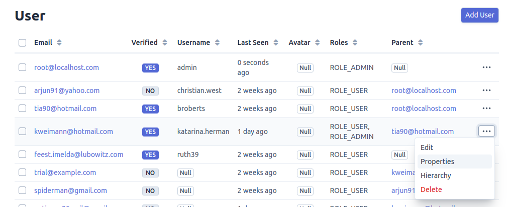
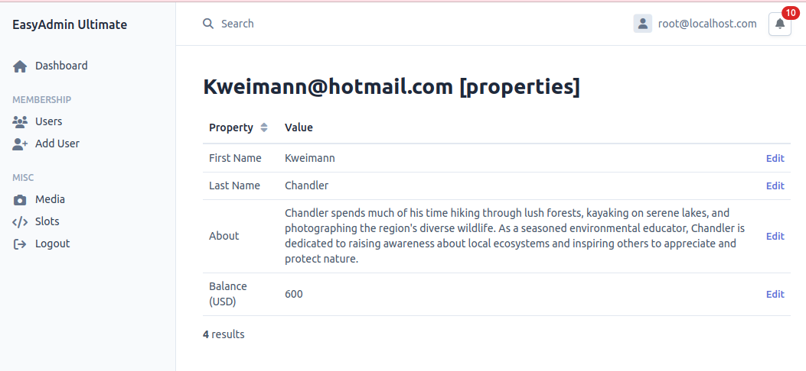
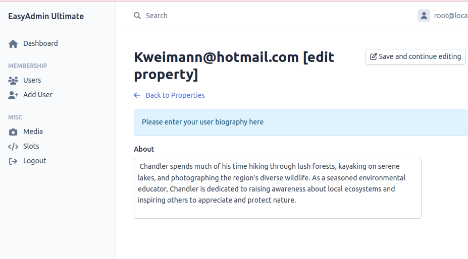

## User Properties and Fields Configuration

In EasyAdmin Ultimate, the `User` entity contains general properties such as email, unique ID, password, and so on. These properties can be edited to add more properties that suit your project's requirements.

However, EasyAdmin Ultimate also provides a `Property` entity, which can be used to store custom metadata for a user. The `Property` entity can be used to store additional information, like a user's bio or any other custom data, without necessarily editing the `User` entity.

## Screenshot

##### Accessing Properties



##### All properties



##### Editing a property



## Configuring User Property Fields

It is not known which properties are suitable for your project's design. Therefore, it is recommended to edit the User Property Configuration to update the system with the right properties, field types, labels, default values, and so on, as needed for your project. To do this, you'll need to edit the `src/Configuration/Factory/UserPropertyFieldDesignFactory.php` file.

This file contains the configuration for the user properties that are used across the entire system. You should remove unwanted properties and then add and configure the required properties.

Here's an example:

```php
namespace App\Configuration\Factory;

use App\Configuration\Design\UserPropertyFieldDesign;
use App\Constants\ModeConstants;
...

protected function configureItems(): void {
    $this->setItem(
        'about',
        (new UserPropertyFieldDesign())
            ->setDescription('Please enter your user biography here')
            ->setFieldFqcn(TextareaField::class)
            ->setLabel('About')
    );

    $this->setItem(
        'balance',
        (new UserPropertyFieldDesign())
            ->setLabel('Balance (USD)')
            ->setValue(0)
            ->setFieldFqcn(MoneyField::class)
            ->setDescription('You cannot edit your account balance')
            ->setConfig(function(MoneyField $fieldInstance) {
                $fieldInstance->setCurrency('USD');
            })
            ->setMode(ModeConstants::READ) // set as read-only
    );
}
```

In this example, two user properties are configured:

1. **About**: This property is a text area field with the label "Biography" and a description "Please tell us about yourself".
2. **Balance**: This property is a money field with the label "Balance (USD)", a default value of 0, and a description "You cannot edit your account balance". The field is set to read-only mode.

Each item you set in the `configureItems()` method becomes the properties applicable to all users in your application.

[Back To Documentation Homepage](../index.md)