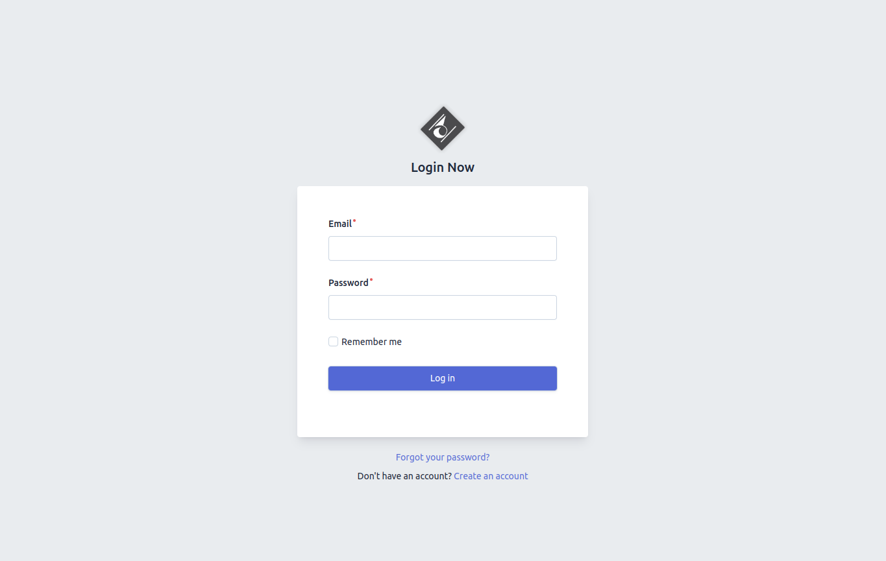
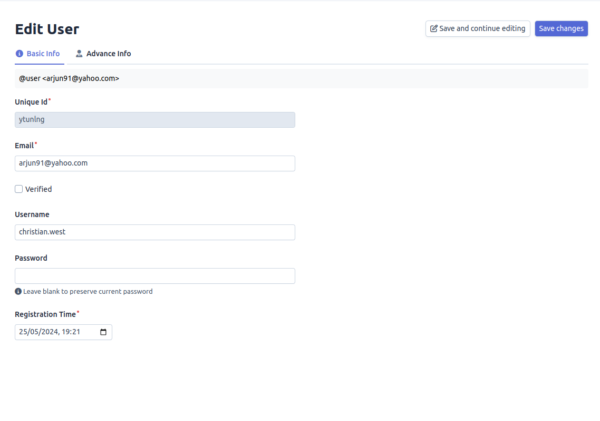
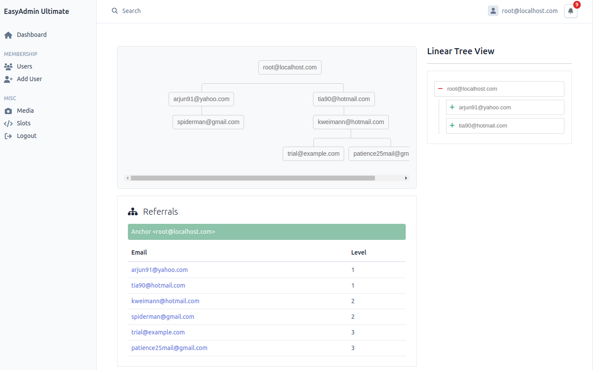
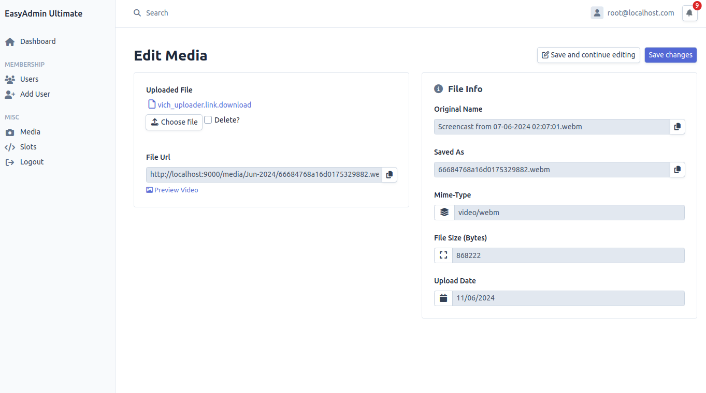
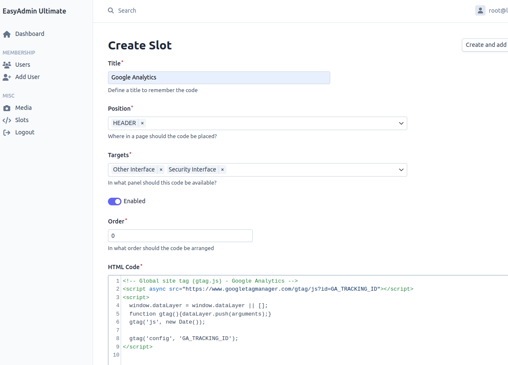
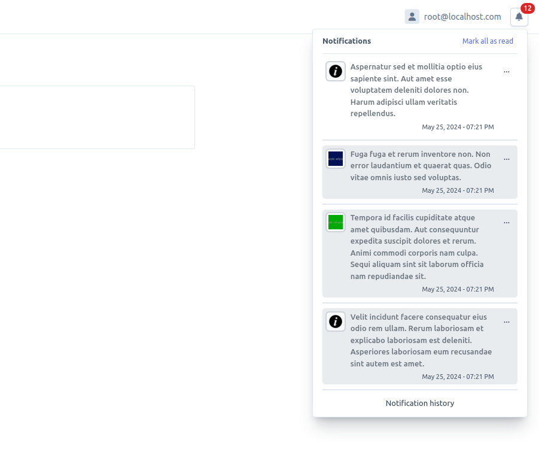

# EasyAdminUltimate

**EasyAdminUltimate** is a comprehensive and enhanced template for EasyAdmin that offers a wide range of additional features and ready-to-use functionalities. This robust platform is designed to facilitate the creation of powerful dashboards with minimal effort, making it suitable for various projects. Below is a detailed description of each feature provided by EasyAdminUltimate.

## Features

### 1. Security System
EasyAdminUltimate includes a complete security system out of the box. This system encompasses:

- **Registration**: Allows new users to create an account.
- **Login**: Enables users to access their accounts securely.
- **Forgot Password**: Provides a mechanism for users to reset their passwords if they forget them.

;

### 2. General Purpose Entities
The template comes with general-purpose entities that are versatile and can be adapted to suit various projects. These entities include pre-configured fields and validation rules, saving developers significant time and effort.

### 3. User CRUD Controller
EasyAdminUltimate offers a user-friendly CRUD (Create, Read, Update, Delete) controller for managing user data. This controller ensures that managing user information is seamless and efficient.

### 4. Affiliation Program
The template includes an affiliation program module, which allows you to set up and manage an affiliate marketing system. This feature helps in tracking referrals and commissions, thus facilitating marketing efforts.

### 5. Genealogy and Hierarchy Tree System
With the genealogy and hierarchy tree system, you can visualize and manage relationships and structures in a hierarchical manner. This is particularly useful for applications that require a clear representation of relationships, such as family trees or organizational charts.

### 6. Media File Upload Manager
The media file upload manager simplifies the process of uploading, organizing, and managing media files. This feature supports various file types and ensures that media management is straightforward and efficient.

### 7. Header and Footer Content Placement Manager
EasyAdminUltimate provides a content placement manager for headers and footers, allowing you to easily customize and manage the content displayed in these sections. This feature supports dynamic content and ensures that your headers and footers are always up-to-date.

### 8. Additional Features
EasyAdminUltimate also includes a variety of other features that enhance its functionality and usability. These additional features are designed to provide a comprehensive solution for building and managing dashboards effectively.

---

If you have any questions or need further assistance, please feel free to contact us at [support@example.com](mailto:support@example.com).
